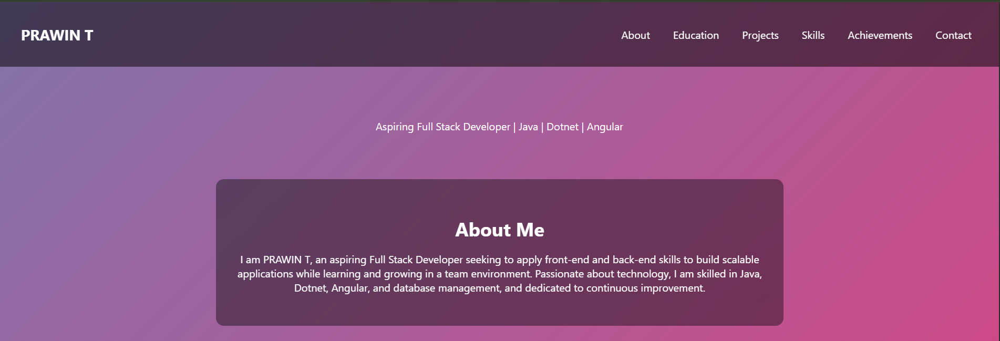
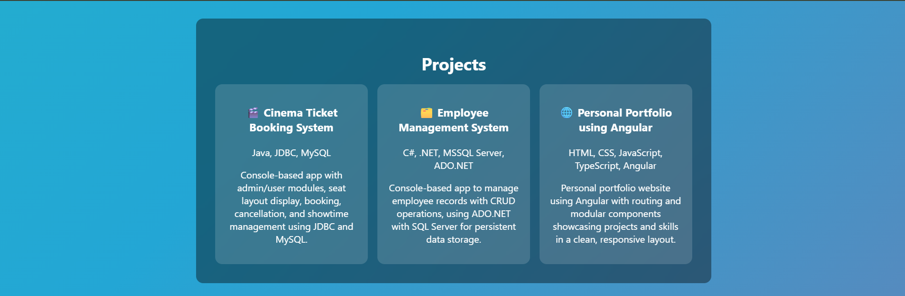

# 🌟 Personal Portfolio Website

A **vibrant, aesthetic, and responsive personal portfolio** using **HTML, CSS, and JavaScript** with animations and clean sections showcasing **projects, education, skills, achievements, and contact details** for professional branding.

## 🚀 Features
✅ Responsive design for all devices  
✅ Animated gradient background for aesthetic appeal  
✅ Typewriter effect to highlight roles dynamically  
✅ Smooth section navigation  
✅ Project showcase with clean descriptions  
✅ Contact section with GitHub and LinkedIn links  
✅ Clean, modern look for recruiters

## 🛠️ Technologies Used
- **Frontend:** HTML5, CSS3, JavaScript
- **Tools:** Git

## 📷 Screenshots
### 🏠 Homepage

### 💼 Projects Section

### 📞 Contact Section

## 📝 What I Learned
✅ Structuring and styling professional portfolio websites  
✅ Using CSS and JavaScript for animations  
✅ Responsive design principles  
✅ Deployment on GitHub Pages for portfolio hosting

## 🔗 Live Demo
[View Live Portfolio](http://127.0.0.1:5500/miniproject/main.html#projects)

## 📫 Contact
- Email: prawintamilarasan@gmail.com
- LinkedIn: [Prawin T](https://www.linkedin.com/in/prawin-t-76a302216)
- GitHub: [Prawin-T](https://github.com/Prawin-T)

---

> “This portfolio is part of my learning journey to become a full stack developer while showcasing my skills and projects to recruiters and potential collaborators.”

